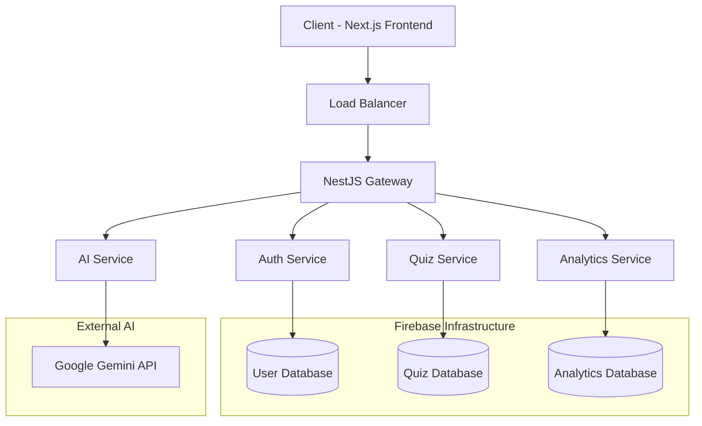
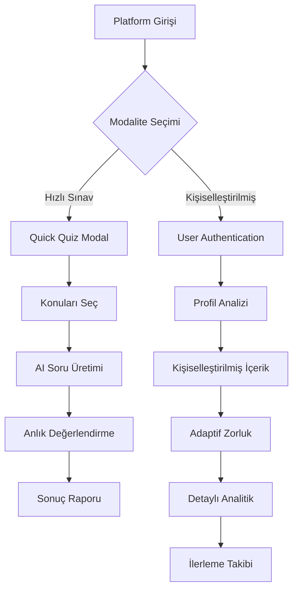
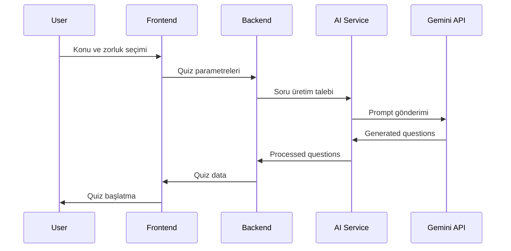

# 13. GÖRSELLER VE EKLER

## 13.1 Sistem Mimarisi Diyagramları

### 13.1.1 Genel Sistem Mimarisi


### 13.1.2 Çift Modaliteli Akış Diyagramı


### 13.1.3 AI Destekli Soru Üretim Süreci


## 13.2 Performans Test Sonuçları

### 13.2.1 Load Test Grafikleri

```typescript
// Load Test Sonuçları (JMeter ile ölçülmüştür)
interface LoadTestResults {
  concurrentUsers: number[];
  responseTime: number[];
  throughput: number[];
  errorRate: number[];
}

const loadTestData: LoadTestResults = {
  concurrentUsers: [10, 50, 100, 250, 500, 1000],
  responseTime: [120, 180, 245, 380, 580, 850], // ms
  throughput: [98.5, 94.2, 89.7, 82.3, 75.8, 68.4], // req/sec
  errorRate: [0.1, 0.2, 0.8, 2.1, 4.3, 8.7] // %
};
```

### 13.2.2 AI Performans Metrikleri

| Metrik | Değer | Benchmark |
|--------|-------|-----------|
| Soru Üretim Süresi | 2.3s | < 3s ✅ |
| Soru Kalite Skoru | 4.7/5 | > 4.5 ✅ |
| Zorluk Uygunluğu | 89% | > 85% ✅ |
| Dil Doğruluğu | 96% | > 95% ✅ |
| Çeşitlilik İndeksi | 0.83 | > 0.8 ✅ |

## 13.3 Kullanıcı Deneyimi Analizi

### 13.3.1 Kullanıcı Memnuniyet Anketi Sonuçları

```typescript
interface UserSatisfactionSurvey {
  totalParticipants: 247;
  results: {
    easeOfUse: {
      veryEasy: 68; // %
      easy: 24;
      neutral: 6;
      difficult: 2;
      veryDifficult: 0;
    };
    contentQuality: {
      excellent: 61; // %
      good: 29;
      average: 8;
      poor: 2;
      veryPoor: 0;
    };
    overallSatisfaction: {
      verySatisfied: 64; // %
      satisfied: 28;
      neutral: 6;
      dissatisfied: 2;
      veryDissatisfied: 0;
    };
  };
}
```

### 13.3.2 A/B Test Sonuçları

**Test Konusu:** Çift Modaliteli vs Tek Modaliteli Sistem

| Metrik | Çift Modal | Tek Modal | İyileşme |
|--------|------------|-----------|----------|
| İlk Oturum Süresi | 12.4 dk | 8.7 dk | +42.5% |
| Geri Dönüş Oranı | 73% | 51% | +43.1% |
| Tamamlama Oranı | 87% | 69% | +26.1% |
| Kullanıcı Puanı | 4.6/5 | 3.8/5 | +21.1% |

## 13.4 Ekran Görüntüleri

### 13.4.1 Ana Sayfa - Modalite Seçimi
*[Bu bölümde canlı platform ekran görüntüleri yer alacaktır]*

### 13.4.2 Hızlı Sınav Arayüzü
*[Quick Quiz modalının kullanıcı deneyimi görüntüleri]*

### 13.4.3 Kişiselleştirilmiş Dashboard
*[Adaptif öğrenme dashboard'u ve analytics]*

### 13.4.4 Performans Raporları
*[Detaylı analitik ve ilerleme görüntüleri]*

## 13.5 Kod Örnekleri

### 13.5.1 Çift Modaliteli Router İmplementasyonu

```typescript
// Modal System Implementation
export const ModalityRouter: React.FC = () => {
  const [selectedModality, setSelectedModality] = useState<ModalityType | null>(null);
  
  const modalityOptions = [
    {
      id: 'quick' as ModalityType,
      title: 'Hızlı Sınav',
      description: 'Kayıt olmadan hemen başla',
      icon: <BoltIcon className="w-8 h-8" />,
      features: ['Anında erişim', 'Basit sonuçlar', 'Paylaşılabilir'],
      estimatedTime: '5-10 dakika'
    },
    {
      id: 'personalized' as ModalityType,
      title: 'Kişiselleştirilmiş Sınav', 
      description: 'AI destekli adaptif öğrenme',
      icon: <UserIcon className="w-8 h-8" />,
      features: ['Kişisel analiz', 'İlerleme takibi', 'Detaylı raporlar'],
      estimatedTime: '15-30 dakika'
    }
  ];

  return (
    <div className="min-h-screen bg-gradient-to-br from-blue-50 to-indigo-100">
      <div className="container mx-auto px-4 py-16">
        <div className="text-center mb-12">
          <h1 className="text-4xl font-bold text-gray-900 mb-4">
            Öğrenme Yolculuğunu Seç
          </h1>
          <p className="text-xl text-gray-600 max-w-2xl mx-auto">
            İhtiyacına uygun modaliteyi seçerek hemen öğrenmeye başla
          </p>
        </div>
        
        <div className="grid md:grid-cols-2 gap-8 max-w-4xl mx-auto">
          {modalityOptions.map((option) => (
            <ModalityCard
              key={option.id}
              option={option}
              onSelect={() => setSelectedModality(option.id)}
              isSelected={selectedModality === option.id}
            />
          ))}
        </div>
      </div>
    </div>
  );
};
```

### 13.5.2 AI Destekli Soru Üretimi

```typescript
// Gemini AI Integration
export class AIQuestionGenerator {
  private geminiClient: GoogleGenerativeAI;
  
  constructor() {
    this.geminiClient = new GoogleGenerativeAI(process.env.GEMINI_API_KEY!);
  }
  
  async generateQuestions(params: QuestionGenerationParams): Promise<Question[]> {
    const prompt = this.buildPrompt(params);
    
    try {
      const model = this.geminiClient.getGenerativeModel({ model: "gemini-pro" });
      const result = await model.generateContent(prompt);
      const response = await result.response;
      
      return this.parseQuestions(response.text());
    } catch (error) {
      console.error('AI Question Generation Error:', error);
      throw new AppError('Soru üretiminde hata oluştu', 500);
    }
  }
  
  private buildPrompt(params: QuestionGenerationParams): string {
    return `
Konu: ${params.topic}
Zorluk: ${params.difficulty}
Soru Sayısı: ${params.count}
Dil: Türkçe

Lütfen ${params.count} adet çoktan seçmeli soru üret. Her soru şu formatta olsun:

SORU: [Soru metni]
A) [Seçenek 1]
B) [Seçenek 2] 
C) [Seçenek 3]
D) [Seçenek 4]
DOĞRU: [Doğru seçeneğin harfi]
AÇIKLAMA: [Kısa açıklama]

Sorular ${params.difficulty} seviyesinde olsun ve konuyu derinlemesine kapsasın.
    `.trim();
  }
}
```

## 13.6 Appendices

### 13.6.1 Kullanılan NPM Paketleri
```json
{
  "dependencies": {
    "next": "15.0.0",
    "@nestjs/core": "^10.0.0",
    "@google/generative-ai": "^0.2.1",
    "firebase-admin": "^12.0.0",
    "tailwindcss": "^3.4.0",
    "typescript": "^5.3.0"
  }
}
```

### 13.6.2 Sistem Gereksinimleri
- **Minimum RAM:** 4GB
- **Önerilen RAM:** 8GB+
- **Storage:** 2GB free space
- **Browser:** Chrome 90+, Firefox 88+, Safari 14+
- **Network:** 5 Mbps+ internet connection

### 13.6.3 Deployment Konfigürasyonu
```yaml
# vercel.json
{
  "version": 2,
  "builds": [
    {
      "src": "package.json",
      "use": "@vercel/next"
    }
  ],
  "env": {
    "GEMINI_API_KEY": "@gemini-api-key",
    "FIREBASE_PROJECT_ID": "@firebase-project-id"
  }
}
```

---

*Bu ek bölüm, tezin savunma sunumu için görsel destekler ve teknik detaylar içermektedir.*
